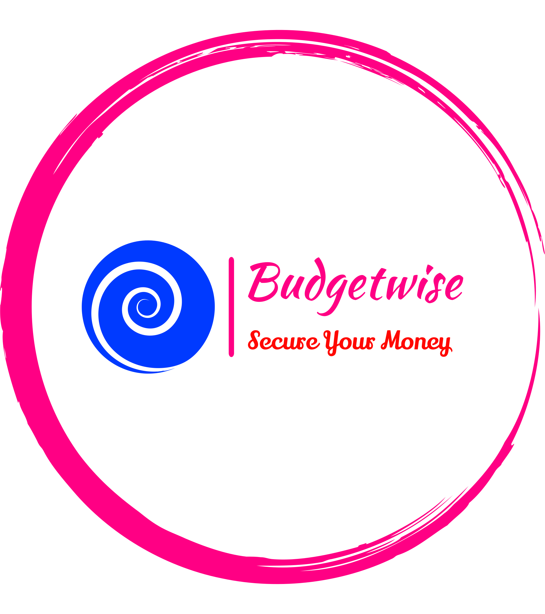

# BudgetWise

<div align="center">




</div>
<!-- TABLE OF CONTENTS -->

# 📗 Table of Contents

- [📖 About the Project](#about-project)
  - [🛠 Built With](#built-with)
    - [Tech Stack](#tech-stack)
    - [Key Features](#key-features)
    <!-- [🚀 Live Demo](#live-demo) -->
- [💻 Getting Started](#getting-started)
  - [Setup](#setup)
  - [Prerequisites](#prerequisites)
  - [Install](#install)
  - [Usage](#usage)
  - [Run tests](#run-tests)
  - [Deployment](#deployment)
- [👥 Authors](#authors)
- [🔭 Future Features](#future-features)
- [🤝 Contributing](#contributing)
- [⭐️ Show your support](#support)
- [🙏 Acknowledgements](#acknowledgements)
- [❓ FAQ](#faq)
- [📝 License](#license)

<!-- PROJECT DESCRIPTION -->

# 📖 BudgetWise <a name="about-project"></a>

> BudgetWise: a web app for easy expense tracking. Register, securely store info, view dashboard of categories and transaction totals. Add new transactions and categories with user-friendly forms. Built on Rails with Devise and Cancancan for security.


## 🛠 Built With <a name="built-with"></a>


### Tech Stack <a name="tech-stack"></a>

<details>
  <summary>Client</summary>
  <ul>
    <li><a href="https://rubyonrails.org/">Ruby on Rails</a></li>
  </ul>
</details>

<details>
  <summary>Server</summary>
  <ul>
    <li><a href="https://rubyonrails.org/">Ruby on Rails</a></li>
  </ul>
</details>

<details>
<summary>Database</summary>
  <ul>
    <li><a href="https://www.postgresql.org/">PostgreSQL</a></li>
  </ul>
</details>

<!-- Features -->

### Key Features <a name="key-features"></a>

- **The app should allow users to sign up and log in with their email and password. Access to certain pages should be restricted to logged-in users only.**
- **Upon logging in, users should see a clean and organized UI with a list of categories. Each category should display its name, icon, and total amount of transactions for that category.**
- **Users should be able to view a list of transactions for a selected category. Transactions should be sortable based on date, name, or amount, and should display the total amount of transactions for that category at the top of the page.**
- **Users should be able to add a new category by filling out a form that includes the category name and icon. Upon successful submission, the user should be taken back to the categories page.**
- **Users should be able to add a new transaction by filling out a form that includes the transaction name, amount, and category. Upon successful submission, the user should be taken back to the transactions page for that category.**
- **The app should have strong security measures to protect user data and prevent unauthorized access.**


<p align="right">(<a href="#readme-top">back to top</a>)</p>

<!-- LIVE DEMO -->

## 🚀 Live Demo <a name="live-demo"></a>

- [Live Link](https://budgetwise-nut9.onrender.com/)

<p align="right">(<a href="#readme-top">back to top</a>)</p>

<!-- GETTING STARTED -->

## 💻 Getting Started <a name="getting-started"></a>

To get a local copy up and running, follow these steps.

### Prerequisites

In order to run this project you need:

- Laptop/Desktop.
- Internet.
- Vs Code.
- Ruby.
- Rails.
- nodejs.
- yarn.js.
- PostgreSQL.

### Setup

Clone this repository to your desired folder:

```sh
  cd my-folder
  git https://github.com/heintayzar-hm/BudgetWise.git
```

### Install

Install this project with:

```sh
  cd BudgetWise
  bundle install
```

### Usage

To run the project, execute the following command:

```sh
  rails server
```

> or

```sh
  bin/dev
```

### Run tests

To run tests, run the following command:

```sh
  rspec
```

### Deployment

You can deploy this project using:

```sh
  https://render.com/
```

<p align="right">(<a href="#readme-top">back to top</a>)</p>

<!-- AUTHORS -->

## 👥 Authors <a name="authors"></a>

👤 **Hein Tay Zar**

- GitHub: [](https://github.com/heintayzar-hm)
- Twitter: [](https://twitter.com/heintayzarhm)
- LinkedIn: [](https://www.linkedin.com/in/hein-tay-zar)

<p align="right">(<a href="#readme-top">back to top</a>)</p>

<!-- FUTURE FEATURES -->

## 🔭 Future Features <a name="future-features"></a>

- **Deploy the project and make it available for every one.**

<p align="right">(<a href="#readme-top">back to top</a>)</p>

<!-- CONTRIBUTING -->

## 🤝 Contributing <a name="contributing"></a>

Contributions, issues, and feature requests are welcome!

Feel free to check the [issues page](https://github.com/heintayzar-hm/BudgetWise/issues).

<p align="right">(<a href="#readme-top">back to top</a>)</p>

<!-- SUPPORT -->

## ⭐️ Show your support <a name="support"></a>

> If you like this project give a ⭐️.

<p align="right">(<a href="#readme-top">back to top</a>)</p>

<!-- ACKNOWLEDGEMENTS -->

## 🙏 Acknowledgments <a name="acknowledgements"></a>

- Thanks to the Microverse team for the great curriculum.
- Hat tip to anyone whose code was used.
- Original design idea by [Gregoire Vella on Behance](https://www.behance.net/gregoirevell).

<!-- LICENSE -->

## 📝 License <a name="license"></a>

This project is [MIT](https://github.com/heintayzar-hm/BudgetWise/blob/dev/Licence) licensed.

<p align="right">(<a href="#readme-top">back to top</a>)</p>
